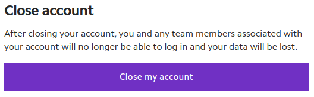

# Getting started

## Can my data be recovered once I've terminated my instance?


We cannot recover your data once you've terminated your instance! Before terminating an instance, make sure to back up all data that you want to keep.

If you want to save data even after you terminate your instance, create a [persistent storage file system](https://lambdalabs.com/blog/persistent-storage-beta/).



The persistent storage file system must be attached to your instance _before_ you start your instance. The file system cannot be attached to your instance after you start your instance.

When you create a file system, a directory with the name of your file system is created in your home directory. For example, if the name of your file system is **PERSISTENT-FILE-SYSTEM**, the directory is created at `/home/ubuntu/PERSISTENT-FILE-SYSTEM`. **Data not stored in this directory is erased once you terminate your instance and cannot be recovered.**


## Can I pause my instance instead of terminating it?

It currently isn't possible to pause (suspend) your instance rather than terminating it. But, this feature is in the works.

Until this feature is implemented, you can use persistent storage file systems to imitate some of the benefits of being able to pause your instance.

## Do you support Kubernetes (K8s)?

We currently don't support Kubernetes, also known as K8s.

## Why can't my program find the NVIDIA cuDNN library?

Unfortunately, the [NVIDIA cuDNN license](https://docs.nvidia.com/deeplearning/cudnn/sla/index.html) limits how cuDNN can be used on our instances.

On our instances, cuDNN can only be used by the PyTorch® framework and TensorFlow library installed as part of [Lambda Stack](https://lambdalabs.com/lambda-stack-deep-learning-software).

Other software, including PyTorch and TensorFlow installed outside of Lambda Stack, won’t be able to find and use the cuDNN library installed on our instances.


Software outside of Lambda Stack usually looks for the cuDNN library files in `/usr/lib/x86_64-linux-gnu`. However, on our instances, the cuDNN library files are in `/usr/lib/python3/dist-packages/tensorflow`.

Creating symbolic links, or "symlinks," for the cuDNN library files might allow your program to find the cuDNN library on our instances.

Run the following command to create symlinks for the cuDNN library files:

```bash
for cudnn_so in /usr/lib/python3/dist-packages/tensorflow/libcudnn*; do
  sudo ln -s "$cudnn_so" /usr/lib/x86_64-linux-gnu/
done
```


## How do I open Jupyter Notebook on my instance?

To open Jupyter Notebook on your instance:

1. In the [GPU instances dashboard](https://cloud.lambdalabs.com/instances), find the row for your instance.
2. Click **Launch** in the **Cloud IDE** column.


Watch Lambda's [GPU Cloud Tutorial with Jupyter Notebook](https://www.youtube.com/watch?v=CKxR6ClKstU) video on YouTube to learn more about using Jupyter Notebook on Lambda GPU Cloud instances.


## Is it possible to use more than one SSH key? <a href="#zd-article-title" id="zd-article-title"></a>

It’s possible to allow more than one SSH key to access your instance. To do so, you need to add public keys to `~/.ssh/authorized_keys`. You can do this with the `echo` command.


You can also [import SSH keys from GitHub](../software/basic-linux-commands-and-system-administration.md#importing-ssh-keys-from-github-accounts).



This FAQ assumes that you’ve already generated another SSH key pair, that is, a private key and a public key.

Public keys look like this:

```
ssh-ed25519 AAAAC3NzaC1lZDI1NTE5AAAAIK5HIO+OQSyFjz0clkvg+48YAihYMo5J7AGKiq+9Alg8 user@hostname
```


SSH into your instance as you normally do and run:

```bash
echo 'PUBLIC-KEY' >> ~/.ssh/authorized_keys
```

Replace `PUBLIC-KEY` with the public key you want to add to your instance. **Make sure to keep the single quotes (`' '`).**

You should now be able to log into your instance using the SSH key you just added.


You can make sure the public key has been added by running:

```
cat ~/.ssh/authorized_keys
```

The last line of output should be the public key you just added.


## What SSH key formats are supported?

You can add SSH keys in the following formats using the [dashboard](dashboard.md#add-or-generate-an-ssh-key) or the [Cloud API](cloud-api.md#add-an-existing-ssh-key-to-your-account):

* OpenSSH (the format `ssh-keygen` uses by default when generating keys)
* RFC4716 (the format PuTTYgen uses when you save a public key)
* PKCS8
* PEM


*   OpenSSH keys look like:

    ```
    ssh-ed25519 AAAAC3NzaC1lZDI1NTE5AAAAIK5HIO+OQSyFjz0clkvg+48YAihYMo5J7AGKiq+9Alg8 foo@bar
    ```
*   RFC4716 keys begin with:

    ```
    ---- BEGIN SSH2 PUBLIC KEY ----
    ```
*   PKCS8 keys begin with:

    ```
    -----BEGIN PUBLIC KEY-----
    ```
*   PEM keys begin with, for example:

    ```
    -----BEGIN RSA PUBLIC KEY-----
    ```


## How long does it take for instances to launch?

Single-GPU instances usually take 3-5 minutes to launch.

Multi-GPU instances usually take 10-15 minutes to launch.


[Jupyter Notebook](getting-started.md#how-do-i-open-jupyter-notebook-on-my-instance) and [Demos](https://docs.lambdalabs.com/cloud/get-started-demos/) can take a few minutes after an instance launches to become accessible.



Billing starts the moment an instance begins booting.


## How do I learn my instance's private IP address and other info?

You can [learn your instance's private IP address](getting-started.md#learn-your-instances-private-ip-address) with the `ip` command.

You can [learn what ports are open on your instance](getting-started.md#learn-what-ports-on-your-instance-are-publicly-accessible) with the `nmap` command.

### Learn your instance's private IP address <a href="#learn-your-instances-private-ip-address" id="learn-your-instances-private-ip-address"></a>

To learn your instance's private IP address, SSH into your instance and run:

```bash
ip -4 -br addr show | grep '10.'
```

The above command will output, for example:

```
enp5s0           UP             10.19.60.24/20
```

In the above example, the instance's private IP address is **10.19.60.24**.

**Tip**


If you want your instance's private IP address and only that address, run the following command instead:

```bash
ip -4 -br addr show | grep -Eo '10\.(25[0-5]|2[0-4][0-9]|[01]?[0-9][0-9]?)\.(25[0-5]|2[0-4][0-9]|[01]?[0-9][0-9]?)\.(25[0-5]|2[0-4][0-9]|[01]?[0-9][0-9]?)'
```

The above command will output, for example:

```
10.19.60.24
```


### Learn what ports on your instance are publicly accessible <a href="#learn-what-ports-on-your-instance-are-publicly-accessible" id="learn-what-ports-on-your-instance-are-publicly-accessible"></a>

You can use Nmap to learn what ports on your instance are publicly accessible, that is, reachable over the Internet.


The instructions, below, assume you're running Ubuntu on your computer.


First, install Nmap on your computer (not on your instance) by running:

```bash
sudo apt install -y nmap
```

Next, run:

```bash
nmap -Pn INSTANCE-IP-ADDRESS
```

Replace **INSTANCE-IP-ADDRESS** with your instance's IP address, which you can get from the [Cloud dashboard](https://cloud.lambdalabs.com/instances).

The command will output, for example:

```
Starting Nmap 7.80 ( https://nmap.org ) at 2023-01-11 13:22 PST
Nmap scan report for 129.159.46.35
Host is up (0.041s latency).
Not shown: 999 filtered ports
PORT   STATE SERVICE
22/tcp open  ssh

Nmap done: 1 IP address (1 host up) scanned in 6.42 seconds
```

In the above example, TCP port 22 (SSH) is publicly accessible.




If `nmap` doesn’t show TCP/22 (SSH) or any other ports open, your:

* Instance might be terminated. Check the [GPU Instances dashboard](https://cloud.lambdalabs.com/instances) to find out.
* Firewall rules might be blocking incoming connections to your instance.



`nmap -Pn INSTANCE-IP-ADDRESS` only scans the 1,000 most common TCP ports.


## How do I close my account?

To close your Lambda GPU Cloud account:

1. Back up all of your data on your instances as well as in your persistent storage file systems.


[You can use rsync to back up your data](../software/basic-linux-commands-and-system-administration.md#using-rsync-to-copy-and-synchronize-files).


2. Terminate all of your instances from the [Cloud dashboard](dashboard.md#terminate-instances) or using the [Cloud API](cloud-api.md#terminating-instances).
3. Delete all of your persistent storage file systems.
4. In the [Cloud dashboard](dashboard.md), under [**Settings**](https://cloud.lambdalabs.com/settings), click **Close my account**. Carefully read the warning in the dialog box that appears. To proceed with closing your account, type in **close account**, then click **Close account**.


