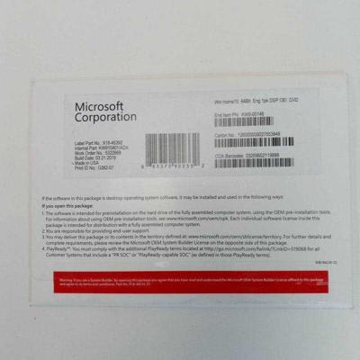

# Troubleshooting and debugging

## Linux

### Generating an NVIDIA bug report

NVIDIA bug reports are useful for troubleshooting systems with NVIDIA GPUs, including Cloud instances.

To generate an NVIDIA bug report, run `sudo nvidia-bug-report.sh`. This command creates a file named `nvidia-bug-report.log.gz` in your current directory. This file contains the NVIDIA bug report.

You can view the contents of the `nvidia-bug-report.log.gz` file by running `zless nvidia-bug-report.log.gz`.


Be sure to generate and provide an NVIDIA bug report whenever [submitting a support ticket to Lambda Support](https://lambdalabs.com/support). Providing an NVIDIA bug report when you first submit a ticket helps Support more quickly troubleshoot any problems you're experiencing with your Lambda system.


## Windows

### How do I gather system information in Windows using DxDiag?

You can use the [DirectX Diagnostic Tool (DxDiag)](https://support.microsoft.com/en-us/windows/open-and-run-dxdiag-exe-dad7792c-2ad5-f6cd-5a37-bf92228dfd85) in Windows to gather system information that might be helpful for troubleshooting.

To use DxDiag to gather system information:

1.  Press the **Windows key** + **R** to open the Run window. Type

    ```
    dxdiag /dontskip /whql:off /64bit /t %userprofile%/Desktop/DxDiag.txt
    ```

    then press **Enter**.
2. After 5-10 seconds, a file named `DxDiag.txt` will be created on the Desktop. This file contains information about the system.

If you prefer to use the graphical interface of DxDiag to gather system information:

1. Press the **Windows key** + **R** to open the Run window.
2. In the Run window, type `dxdiag` then press **Enter**.
3. Click **Save All Information** to save the system information to a text file.

### How do I gather system information in Windows using MSINFO32?

You can use [MSINFO32](https://support.microsoft.com/en-us/topic/description-of-microsoft-system-information-msinfo32-exe-tool-10d335d8-5834-90b4-8452-42c58e61f9fc), also known as Microsoft System Information or Msinfo32.exe, to gather useful information for troubleshooting your computer.

To use MSINFO32:

1. Press the **Windows key** + **R** to open the Run window. Type `cmd` then press **Ctrl** + **Shift** + **Enter** to open an elevated command prompt.
2.  In the elevated command prompt, run:

    ```
    MSInfo32 /report %userprofile%/Desktop/sysinfo.txt
    ```

This will create a file on your Desktop named `sysinfo.txt` that contains useful information about your computer.


You can additionally use [DxDiag](troubleshooting-and-debugging.md#how-do-i-gather-system-information-in-windows-using-dxdiag) to gather useful information for troubleshooting.


### How do I prevent an incorrect clock in Windows after booting Ubuntu?

Ubuntu saves the current time to the machine hardware clock in [UTC](https://en.wikipedia.org/wiki/Coordinated\_Universal\_Time). Windows saves the current time to the machine hardware clock in the local time. Because Ubuntu and Windows save the current time to the machine hardware clock differently, the current time displays incorrectly in Windows after booting Ubuntu.

To fix this problem:

1.  Press the **Windows key** + **R** to open the Run window. Type `cmd` then press **Ctrl** + **Shift** + **Enter**.

    This command opens the Command Prompt window with elevated (admin) privileges.
2.  In the Command Prompt window, run the command: `reg add "HKEY_LOCAL_MACHINE\System\CurrentControlSet\Control\TimeZoneInformation" /v RealTimeIsUniversal /d 1 /t REG_DWORD /f`.

    If Windows asks to update the clock due to DST (Daylight Savings Time), let Windows update the clock. The current time will be saved to the machine hardware clock in UTC but will display in Windows in the local time.

To learn more about this problem, see the [Arch Linux documentation on system time](https://wiki.archlinux.org/title/System\_time).

### How do I run a filesystem check on Windows and repair system files?

If Windows is freezing or behaving erratically, there might be a problem with the filesystem or system files. Examples of erratic behavior include:

* blue screens
* crashing applications
* sluggish performance
* failed Windows updates

You can use the built-in [Deployment Image Servicing and Management (DISM)](https://docs.microsoft.com/en-us/windows-hardware/manufacture/desktop/what-is-dism?view=windows-10) and System File Checker (SFC) tools to try to fix the problem.

To use the DISM tool to fix problems with the filesystem or system files:

1. Press the **Windows key** + **R** to open the Run window.
2.  In the Run window, type `cmd` then press **Ctrl** + **Shift** + **Enter**.

    This command opens the Command Prompt window with elevated (admin) privileges.
3.  In the Command Prompt window, run the command:

    ```
    DISM.exe /Online /Cleanup-Image /RestoreHealth
    ```

    This command performs cleanup and recovery operations on the system files. For more information, see Microsoft’s documentation on [repairing a Windows image](https://docs.microsoft.com/en-us/windows-hardware/manufacture/desktop/repair-a-windows-image?view=windows-10).
4. After `DISM.exe` finishes, run the following command in the Command Prompt window: `sfc /scannow`. This command scans all protected system files and replaces corrupted files. For more information, see Microsoft’s documentation on [using SFC to repair missing or corrupted system files](https://support.microsoft.com/en-us/topic/use-the-system-file-checker-tool-to-repair-missing-or-corrupted-system-files-79aa86cb-ca52-166a-92a3-966e85d4094e).

Run the `sfc /scannow` command up to 3 times until you receive the message: `Windows Resource Protection did not find any integrity violations.`


If after running this command 3 times you do not receive the message `Windows Resource Protection did not find any integrity violations`, it is unlikely that a problem with the filesystem or system files is the cause of Windows freezing or behaving erratically.

Reboot the machine and test to see if Windows continues to freeze or behave erratically.


### Where can I find my Windows license key?

If you purchased your system with Windows 11 preinstalled, you can [download and reinstall Windows 11](https://www.microsoft.com/software-download/windows11) without a license key.

If you purchased your system with Windows 10 preinstalled, your Windows license key is located on a cardboard envelope included with your system.

<figure><figcaption><p>Cardboard envelope with Windows license key</p></figcaption></figure>


**Make sure not to lose your license key!** We can't replace lost license keys.

Inside of the license key envelope is a sticker with the license key on it. We strongly suggest affixing this sticker to your system's chassis.

