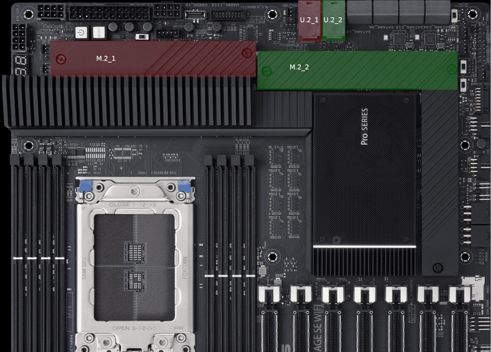

# General

## Where can I download recovery images for my workstation?

Workstation recovery images can be downloaded from our [Lambda Stack and recovery images docs page](../lambda-stack-and-recovery-images.md#workstations).

## How do I set the fan speeds for my workstation?

You can set baseline fan speeds for your workstation using `ipmitool`. Once baseline fan speeds are set, you can fine-tune the fan speeds in the web-based IPMI interface.


These instructions are only for workstations using an [ASUS Pro WS WRX80E-SAGE SE WIFI](https://www.asus.com/motherboards-components/motherboards/workstation/pro-ws-wrx80e-sage-se-wifi/) motherboard.

Before proceeding with these instructions, run `sudo dmidecode -t 2 | grep Name` to confirm your workstation uses the above motherboard. You should see: `Product Name: Pro WS WRX80E-SAGE SE`.


First, install `ipmitool` by running:

```bash
sudo apt -y update && sudo apt -y install ipmitool
```

Then, set the baseline fan speeds by running:

```bash
sudo ipmitool raw 0x30 0x0E 0x04 0x00 0x32 0x23 0x49 0x46 0x5a 0x64 0x61 0x64 0x61 0x64 && \
sudo ipmitool raw 0x30 0x0E 0x04 0x01 0x32 0x23 0x49 0x46 0x5a 0x64 0x61 0x64 0x61 0x64 && \
sudo ipmitool raw 0x30 0x0E 0x04 0x02 0x32 0x23 0x49 0x46 0x5a 0x64 0x61 0x64 0x61 0x64 && \
sudo ipmitool raw 0x30 0x0E 0x04 0x03 0x32 0x23 0x49 0x46 0x5a 0x64 0x61 0x64 0x61 0x64 && \
sudo ipmitool raw 0x30 0x0E 0x04 0x04 0x32 0x23 0x49 0x46 0x5a 0x64 0x61 0x64 0x61 0x64 && \
sudo ipmitool raw 0x30 0x0E 0x04 0x05 0x32 0x23 0x49 0x46 0x5a 0x64 0x61 0x64 0x61 0x64 && \
sudo ipmitool raw 0x30 0x0E 0x04 0x06 0x32 0x23 0x49 0x46 0x5a 0x64 0x61 0x64 0x61 0x64
```


See the [ASUS ASMB9-iKVM Fan Customized Mode User Guide \[PDF\]](https://docs.lambdalabs.com/workstations/fan-speeds-wrx80e-sage/ASMB9-iKVM\_Fan\_Customized\_Mode\_User\_Guide\_v0.71\_20191112.pdf) to learn how to customize fan speeds in the web-based IPMI interface.

Note that Lambda workstations are high-performance systems and generate plenty of heat. For this reason, it's not recommended to use the guide's power efficiency fan policy.


## How do I upgrade my Samsung 980 PRO NVMe SSD's firmware?

Follow these instructions to upgrade your Samsung 980 PRO NVMe SSD's firmware.


[Samsung 980 PRO NVMe SSDs with the older 3B2QGXA7 firmware are known to fail](https://www.pugetsystems.com/support/guides/critical-samsung-ssd-firmware-update/).

To know if your SSD is using the 3B2QGXA7 firmware, install the `smartmontools` package by running `sudo apt -y install smartmontools`. Then, run `sudo smartctl -a /dev/nvme0`.

If your SSD is using the 3B2QGXA7 firmware, it's recommended that you upgrade the firmware as soon as possible.


First, download the latest firmware ISO from Samsung's website by running:

```bash
wget https://semiconductor.samsung.com/resources/software-resources/Samsung_SSD_980_PRO_5B2QGXA7.iso
```

Next, run `sudo -s` to open a shell with root (administrator) privileges.

Finally, run:

```bash
mkdir /mnt/iso && mount -o loop Samsung_SSD_980_PRO_5B2QGXA7.iso /mnt/iso && \
mkdir fwupdate && cd fwupdate && \
gzip -dc /mnt/iso/initrd | cpio -idv --no-absolute-filenames && \
cd root/fumagician && ./fumagician
```

The above command mounts the firmware upgrade ISO, extracts the firmware upgrade, and launches the upgrade.

After the firmware upgrade completes, restart your computer.

Run `sudo smartctl -a /dev/nvme0` to confirm your SSD is using the new firmware.

## How do I fix slow performance with my Gen 4 M.2 NVMe drive?

If you're experiencing slow performance or errors with your Gen 4 M.2 NVMe drive, you might need to reinstall the drive into a new slot on your workstation's motherboard.

There's a known issue where Gen 4 M.2 NVMe drives experience slow performance and errors when installed into the **M.2\_1** slot in ASUS Pro WS WRX80E-SAGE SE WIFI motherboards, which are used in Lambda workstations. The manufacturer of the motherboard, ASUS, is aware of the issue.

Until ASUS releases a BIOS update that fixes the issue, you can work around the issue, depending on your workstation’s drive configuration:

* If you have only 1x M.2 NVMe drive in your workstation, move the drive from slot **M.2\_1** to slot **M.2\_2**.
* If you have 1x M.2 NVMe drive and 1x U.2 NVMe drive in your workstation, move the M.2 NVMe drive from slot **M.2\_1** to slot **M.2\_2**. Move the U.2 NVMe drive from slot **U.2\_1** to slot **U.2\_2**.

<figure><figcaption><p>Picture of ASUS Pro WS WRX80E-SAGE SE WIFI motherboard with M.2 and U.2 slots highlighted</p></figcaption></figure>

## Can I upgrade my workstation to RTX 4090 GPUs?

Workstations can't be upgraded to RTX 4090 GPUs.

To ensure system stability and longevity, the RTX 4090 GPUs we use in our workstations are liquid-cooled, as opposed to air-cooled like other GPUs. To accommodate the liquid-cooling solution and dissipate the amount of heat put out by the RTX 4090 GPUs, the workstation case requires special fan designs and layouts.
